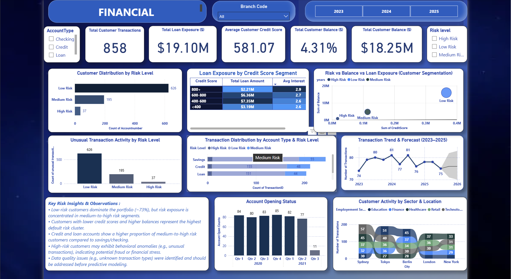

# Financial Bank Dashboard 📊

## Overview
This Power BI dashboard analyzes customer transactions, loan exposure, and risk segmentation to provide actionable insights for financial decision-making.

## Key Features
- Customer risk segmentation (Low, Medium, High)
- Loan exposure analysis by credit score
- Transaction trend & forecasting
- Unusual transaction detection
- KPI tracking (transactions, balance, credit score)

## Tools Used
- Power BI
- DAX
- Data Modeling

## Dashboard Preview

## Key Insights
- 73% of customers fall under low-risk category
- High-risk customers show unusual transaction behavior
- Loan exposure is concentrated in medium-risk segments
- Customers with lower credit scores have higher default probability

## Business Value
- Helps banks identify high-risk customers early
- Supports loan approval decisions
- Improves fraud detection strategy