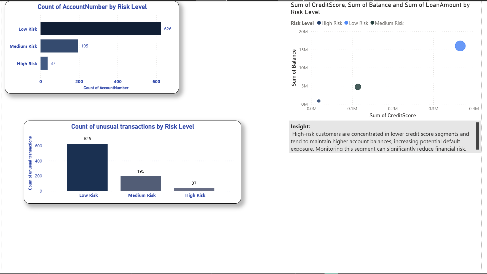
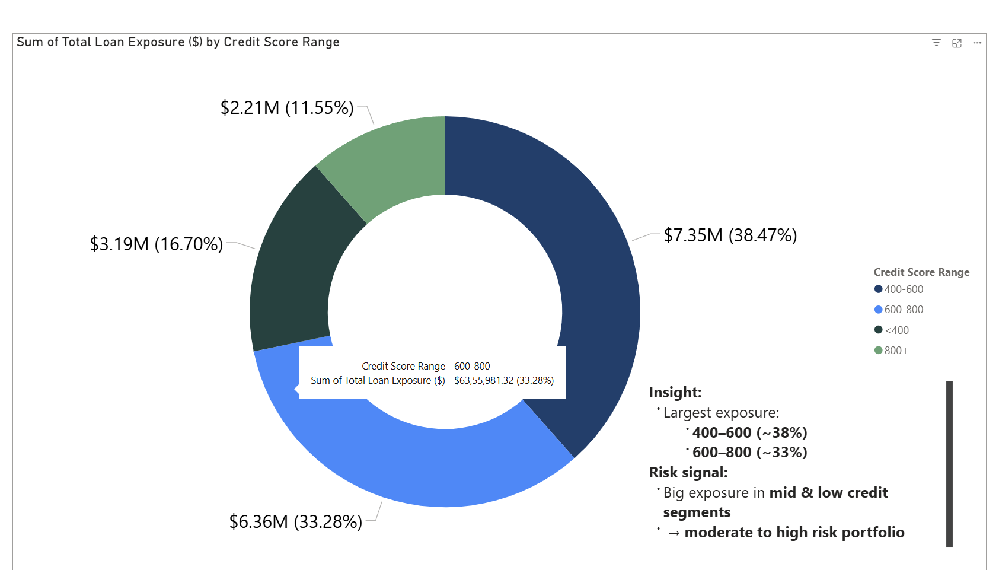
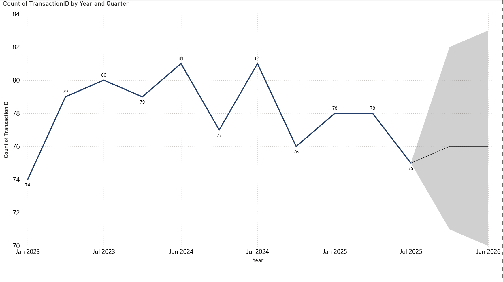

# Financial Bank Dashboard 📊

## Overview
This Power BI dashboard analyzes banking transactions to identify high-risk customers, evaluate loan exposure across credit segments, and detect behavioral anomalies for better financial decision-making.

## Problem Statement
Banks face challenges in identifying high-risk customers and managing loan exposure effectively. This dashboard provides a data-driven approach to monitor risk, detect anomalies, and support strategic financial decisions.

## Key Features
- Risk segmentation of customers into Low, Medium, and High risk groups
- Credit score-based loan exposure analysis
- Time-series transaction trend with forecasting
- Detection of unusual transaction patterns indicating potential fraud
- KPI monitoring for financial performance

## Tools & Techniques
- Power BI for interactive dashboard development
- DAX for calculated metrics and KPI modeling
- Data Modeling for relational data structuring and performance optimization

 -----

## Dashboard Preview

---

## Risk Analysis

---

## Loan Exposure Analysis

---

## Transaction Trends

---

## Key Insights
- Majority (73%) of customers are low-risk, indicating a stable portfolio but potential under-utilization of high-return segments
- High-risk customers exhibit unusual transaction patterns, signaling possible fraud or financial instability
- Loan exposure is heavily concentrated in medium-risk segments, increasing default vulnerability
- Lower credit score customers contribute disproportionately to risk, requiring stricter approval strategies

## Business Impact
- Enables early identification of high-risk customers
- Improves loan approval and risk management strategies
- Enhances fraud detection through behavioral analysis

## Recommendations
- Prioritize monitoring of medium-risk customers with high loan exposure
- Implement anomaly detection for high-risk transaction patterns
- Refine credit-based loan approval policies to reduce default risk

## Conclusion
This dashboard demonstrates how data-driven insights can support financial institutions in reducing risk, improving decision-making, and enhancing operational efficiency.
